# A.L.A. — Manuel utilisateur

**Audio Live Assistant** by Electrosens R&D — console de mixage live
assistée. Ce manuel s'adresse à l'**utilisateur** de la console (pas au
développeur — voir `MIXER_PRO_REFERENCE.md` pour la technique).

Version du manuel : 2026-07-08 (système V13).

---

## Sommaire

1. [Mise en route](#1-mise-en-route)
2. [Tour de l'interface](#2-tour-de-linterface)
3. [Page MIXER — la table](#3-page-mixer)
4. [Page EFFETS — les 4 bus](#4-page-effets)
5. [Page MASTERING](#5-page-mastering)
6. [Page PADS — le sampleur](#6-page-pads)
7. [Page LOOPER — la loopstation](#7-page-looper)
8. [Page EXPANDEUR — le module de sons MIDI](#8-page-expandeur)
9. [Page AUTO MIX — l'assistant](#9-page-auto-mix)
10. [Page SCÈNE — profils et pilotage](#10-page-scène)
11. [Pages ROUTING et SYSTÈME](#11-pages-routing-et-système)
12. [Les effets par tranche (drawer)](#12-le-drawer-deffets-par-tranche)
13. [Guides pratiques](#13-guides-pratiques)
14. [Dépannage](#14-dépannage)

---

## 1. Mise en route

### Branchements

| Prise | Usage |
|---|---|
| Entrées micro 1–8 (M1–M8) | micros / instruments (préamplis TAC) |
| Sorties analogiques 1–8 (S1–S8) | façade, retours… S1/S2 = master |
| **USB (un seul câble)** vers le PC | carte son **8 entrées + 8 sorties** (U1–U8) **et** port **MIDI in/out** — le PC voit « Debix UAC2 8x8 » et « Debix UAC2 8x8 MIDI 1 » |
| Écran tactile | console native (mêmes fonctions que le web) |

### Démarrage

1. Alimente la console : le logo **A.L.A.** s'affiche, puis l'application
   démarre seule (environ 30 s).
2. La console retrouve **tout son état** : faders, routages, effets,
   automatismes, sons du synthé.
3. Depuis un PC/tablette/téléphone du réseau :
   **`http://<adresse-console>:8080/beta`** — interface identique à
   l'écran. Astuce : `…/beta?page=SCENE` ouvre directement une page.

> ⚠ Après une coupure **secteur** (pas un simple redémarrage), si la
> console démarre muette : voir [Dépannage](#14-dépannage).

---

## 2. Tour de l'interface

Le **bandeau du haut** affiche en permanence : l'horloge de session, le
**niveau master** (LUFS/crête), la **latence**, la charge CPU/DSP/NPU,
et le bouton RESET TAC.

La **barre du bas** = les 10 pages :
`MIXER · MASTERING · EFFETS · PADS · LOOPER · EXPANDEUR · AUTO MIX · SCÈNE · ROUTING · SYSTÈME`

---

## 3. Page MIXER

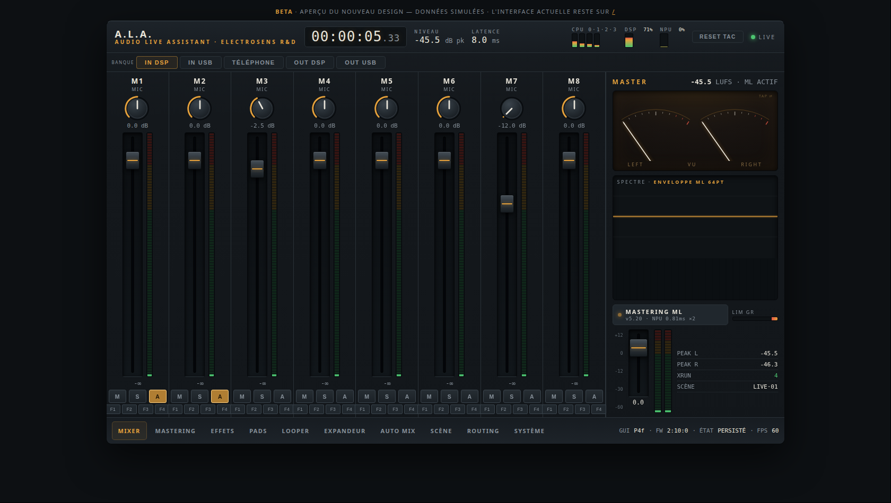

La table elle-même, par **banques** : `IN DSP` (micros M1–M8), `IN USB`
(U1–U8, ce que le PC envoie), `TÉLÉPHONE`, `OUT DSP`, `OUT USB`.

Sur chaque tranche :

- **Fader** = le niveau de la tranche dans le mix (−60…+6 dB) ;
- **Vumètre** à côté du fader ;
- **M** = mute · **S** = solo · **A** = adhésion à l'**automix Dugan**
  (voir AUTO MIX) — la petite **barre verte** sous le fader montre alors
  le gain automatique appliqué ;
- **F1–F4** (grille 2×2) = départs vers les 4 **bus d'effets** ;
- **Tap sur le nom** de la tranche → ouvre le
  [drawer d'effets](#12-le-drawer-deffets-par-tranche) (gate, TAC, DSP).

À droite, le **master** : aiguilles VU, spectre temps réel avec
l'enveloppe du mastering ML, fader master et indicateurs (PEAK, XRUN,
SCÈNE active).

## 4. Page EFFETS

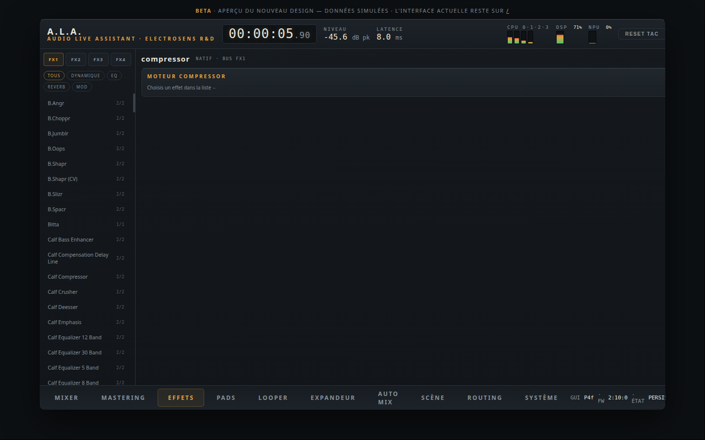

Les **4 bus d'effets stéréo**. Pour chaque bus : choisis un moteur
(effets natifs ou **plugins LV2** — réverbes, delays, choruses… ~345
plugins), règle ses paramètres, et dose le **retour** dans le mix.
L'envoi se fait depuis les tranches (boutons F1–F4).

## 5. Page MASTERING

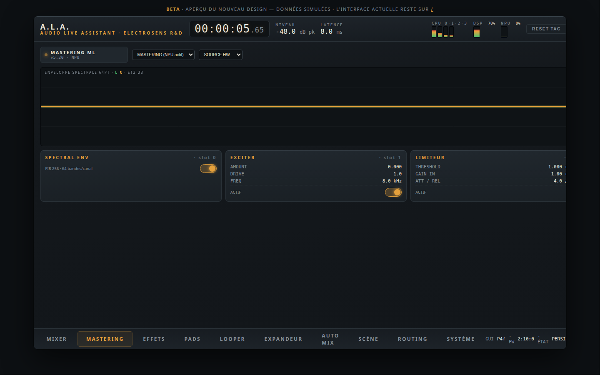

La chaîne de sortie du master (S1/S2) :

- **Source** : `HW` (direct), `PASSTHROUGH`, ou `MASTERING` (chaîne de
  traitement) ;
- **Chaîne d'insert** : jusqu'à 8 plugins en série (EQ, compresseur,
  limiteur…), avec le **mastering assisté NPU** (le modèle embarqué
  analyse le programme et pilote la correction — l'enveloppe s'affiche
  sur le spectre) ;
- Le **spectre** et la correction en temps réel.

Le bouton **MASTERING ON/OFF** de la page SCÈNE court-circuite toute la
chaîne instantanément (comparaison avant/après).

## 6. Page PADS

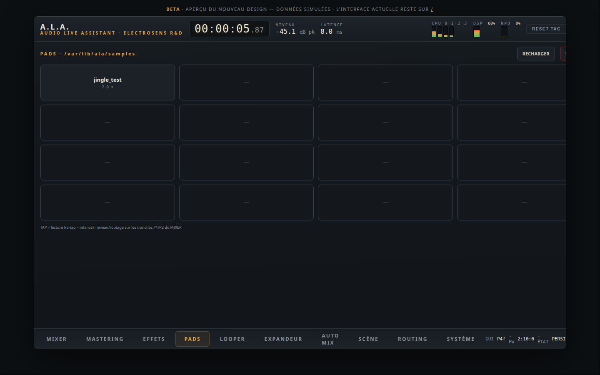

Le **sampleur** : 16 pads. Dépose tes fichiers **WAV 48 kHz** dans
`/var/lib/ala/samples` (via le réseau) puis **RECHARGER**.

- **Tap sur un pad** = lecture immédiate (re-tap = relance depuis le
  début) — jingles, virgules, applaudissements… ;
- **STOP ALL** coupe tout ;
- Le son des pads passe par les tranches **P1/P2** (banque TÉLÉPHONE) :
  leur fader et leur routage règlent le niveau et la destination.

## 7. Page LOOPER

> **Enregistrement quantifié (V13.2)** : la première piste enregistrée
> définit la boucle (durée/début/fin). Sur les pistes suivantes, **REC
> arme la piste (⏳ ARMÉ, ambre clignotant)** : l'enregistrement démarre
> tout seul au prochain début de boucle et s'arrête exactement un tour
> plus tard, puis la couche passe en lecture. Re-taper REC désarme.

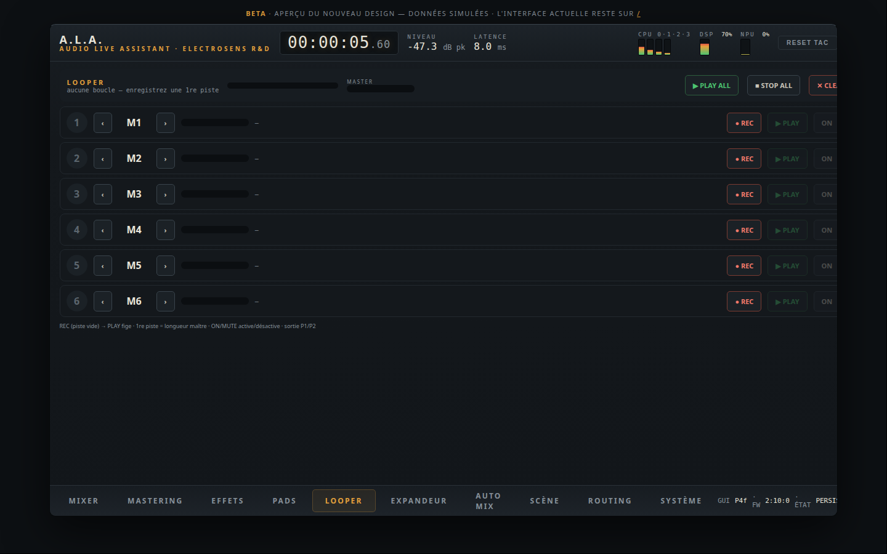

Une **loopstation 6 pistes** (type RC-505). Chaque piste est une
**couche indépendante** :

1. Choisis la **source** de la piste (‹ › : M1…M8 ou USB1…USB8) ;
2. **● REC** sur une piste vide → joue → **▶ PLAY** : la **première
   piste fixe la durée de la boucle** ;
3. Les pistes suivantes s'enregistrent **alignées** (un tour complet,
   passage en lecture automatique) ;
4. **ON/MUTE** active/désactive chaque couche sans l'effacer ;
   **✕** efface la piste (les autres continuent) ;
5. En-tête : position dans la boucle, **vumètre par piste** (rouge
   pendant l'enregistrement = ton niveau d'entrée), **MASTER** de la
   somme, PLAY ALL / STOP ALL / CLEAR ALL.

Exemple avec un seul micro : enregistre la percussion (piste 1), puis la
basse vocale (piste 2), puis les nappes (piste 3) — chaque vumètre bat au
rythme de **sa** couche, et tu actives/désactives les couches à volonté.
La sortie passe par **P1/P2**.

## 8. Page EXPANDEUR

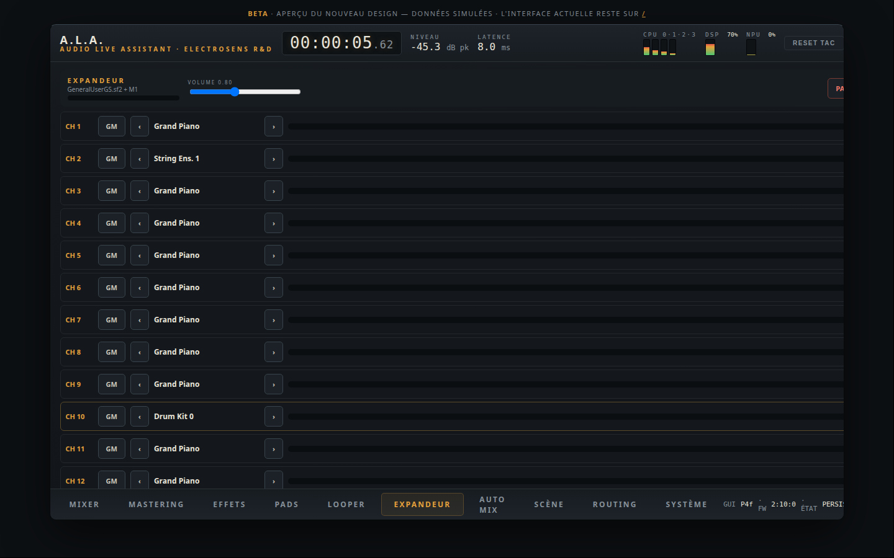

Un **module de sons MIDI multi-timbral** : branche ton clavier/DAW sur le
port MIDI USB (« Debix UAC2 8x8 MIDI 1 ») — chaque **canal MIDI 1–16** a
son propre son :

- Bouton **GM/M1** : bascule entre la banque **GM** (128 sons General
  MIDI + kits — piano, cordes, cuivres…) et le **synthé M1** maison ;
- **‹ ›** : choisis le programme GM ou le patch M1 ; **CH 10 = batterie** ;
- **ÉDIT** (canaux M1) : l'**éditeur de patch** plein écran — 2
  oscillateurs (324 multisamples), filtre, enveloppes, LFO, tout en
  curseurs 0-99 **modifiables pendant que tu joues** ; **SAUVER**
  conserve le patch ;
- **Vumètres d'activité** par canal, **VOLUME** global, **PANIC** (coupe
  toutes les notes, y compris une note bloquée).

Le son sort par **P1/P2**.

## 9. Page AUTO MIX

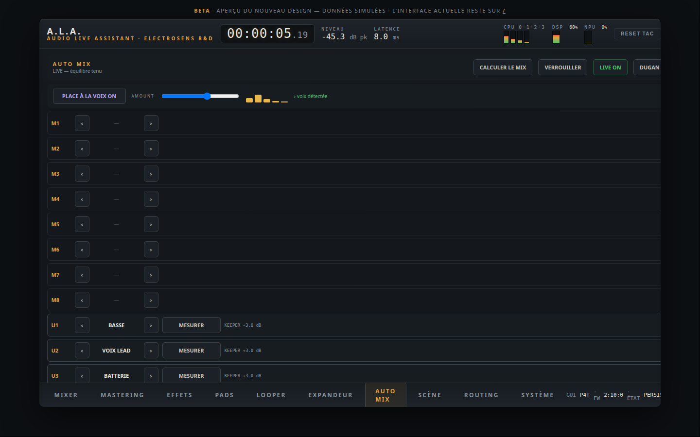

L'**assistant de sonorisation** — pour mixer un groupe même sans être
ingé-son. Voir le [guide pratique](#sonoriser-un-groupe) pour la
procédure complète. Sur la page :

- Une ligne par tranche : **RÔLE** (‹ › : VOIX LEAD, CHŒURS, GR. CAISSE,
  C. CLAIRE, BATTERIE, BASSE, GUITARE, CLAVIER, LIGNE), bouton
  **MESURER** (12 s), et le trim **KEEPER** appliqué en live ;
- Bandeau : **CALCULER LE MIX**, **VERROUILLER L'ÉQUILIBRE**, **LIVE
  ON/OFF** (le suivi), **DUGAN ON/OFF** + **⚙** (l'automix parole et ses
  réglages response/floor/poids) ;
- Bandeau **PLACE À LA VOIX** : l'unmasking (la musique s'écarte des
  fréquences de la voix quand elle chante) — interrupteur, dosage
  **AMOUNT**, et les 5 barres de creusement en direct.

## 10. Page SCÈNE

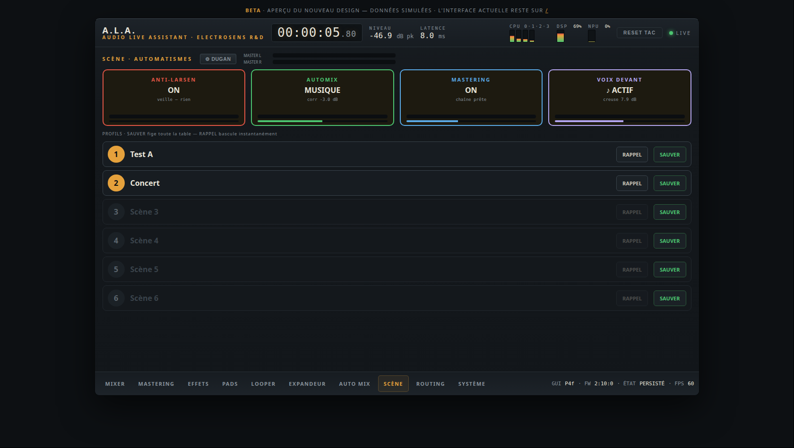

Le **poste de pilotage** :

### Les 4 gros boutons (actifs — tap = ON/OFF)

| Bouton | Ce qu'il pilote | Ce qu'il affiche |
|---|---|---|
| **ANTI-LARSEN** | la protection larsen automatique | nb de notches posés + dernière fréquence + niveau micros |
| **AUTOMIX** | tri-état : OFF → **MUSIQUE** (suivi de groupe) → **VOIX** (Dugan parole) | correction en cours (dB) + niveau des entrées |
| **MASTERING** | la chaîne master ON/OFF (bypass instantané) | niveau de sortie L/R |
| **VOIX DEVANT** | l'unmasking voix/musique | creusement total (dB) + ♪ quand la voix est détectée + niveau voix |

Chaque bouton porte un **vumètre signal** réel (vert → ambre → rouge
près de 0 dBFS) et une barre d'activité. Le **MASTER L/R** est affiché
en permanence en tête de page.

### Les 6 profils (scènes)

- **SAUVER** : fige **toute la table** (faders, routages, effets par
  tranche, automatismes, chaîne mastering, réglages TAC/DSP, sons du
  synthé) — un clavier tactile te demande le **nom** de la scène ;
- **RAPPEL** : bascule **instantanée** vers le profil, sans coupure du
  son. Sécurité anti-fausse-manip : le bouton demande **CONFIRMER ?**
  (2ᵉ tap dans les 3 s).

Exemples de profils : « Conférence » (Dugan + anti-larsen), « Concert »
(auto-mix musique + voix devant), « Balance », « DJ set »…

## 11. Pages ROUTING et SYSTÈME

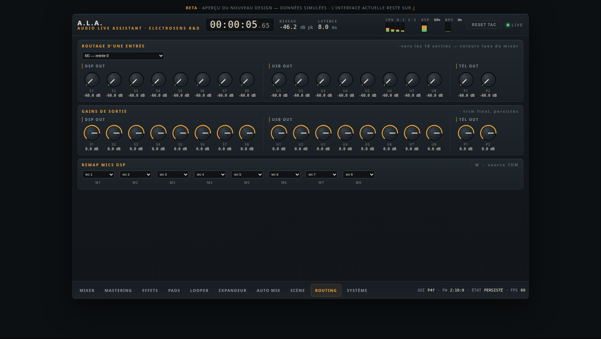

**ROUTING** : la matrice complète — quelle entrée va vers quelle sortie,
à quel niveau (potards par croisement). C'est ici qu'on envoie M1 vers
la façade ET vers l'enregistrement USB, ou un stem USB vers les sorties.

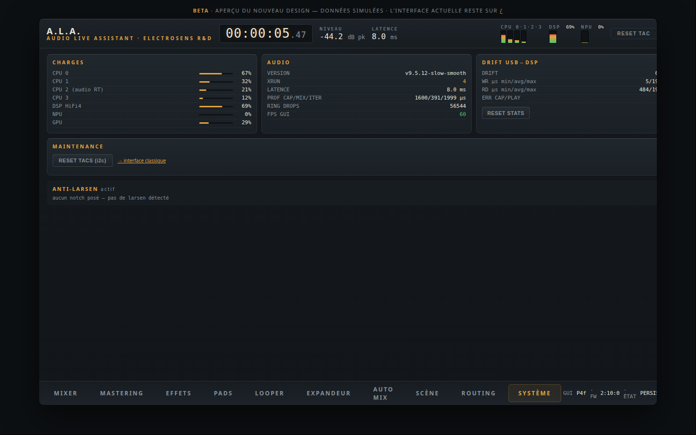

**SYSTÈME** : état des services, réglages TAC bas niveau, **liste live
des notches anti-larsen** (fréquence, profondeur, âge), **reset usine**
(tout remettre à zéro), infos de version.

## 12. Le drawer d'effets par tranche

Depuis la page MIXER, **tap sur le nom d'une tranche** :

- **Onglet GATE** : l'expandeur/noise gate de la voie — interrupteur,
  **barre de réduction en temps réel**, seuil/ratio/attack/release/
  range/hold. C'est l'outil « toms de batterie » et « micros ouverts » ;
- **Onglet TAC BIQUADS** : l'égaliseur paramétrique (ci-dessous) ;
- **Onglets TAC** (voies micro) : volumes, AGC/HPF du préampli ;
- **Onglets CHAÎNE DSP** : compresseur DRC et multibande **par canal** ;
- **ROUTAGE + SENDS** : le routage rapide de la tranche.

### L'égaliseur paramétrique (onglet TAC BIQUADS)

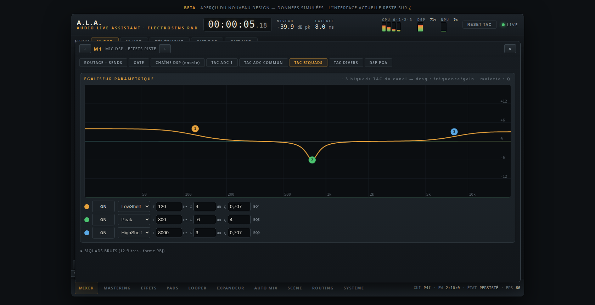

Un EQ « comme sur une console pro », qui pilote les biquads matériels du
préampli TAC :

- **La courbe de réponse** (20 Hz – 20 kHz) : attrape une **poignée
  numérotée** et déplace-la — horizontal = fréquence, vertical = gain
  (ou largeur Q pour les types sans gain). À la souris, la **molette
  règle le Q**. Attraper une poignée éteinte active la bande en Peak.
- **La FFT de la voie** s'affiche en vert derrière la courbe : tu vois
  en direct l'effet de ton réglage sur le spectre réel du micro.
- **Une ligne par bande** : ON/OFF, type de filtre (Peak, LowShelf,
  HighShelf, passe-haut/bas, Notch…), champs **F / G / Q** synchronisés
  avec la courbe.
- 3 bandes par voie d'entrée (limite matérielle du TAC). Sur les
  **sorties**, 1 bande utilisateur (les deux autres appartiennent à
  l'anti-larsen). Les atténuations sont fidèles ; les boosts sont
  plafonnés par le format interne du codec.
- « BIQUADS BRUTS » (replié) : accès expert aux 12 blobs hexadécimaux.

---

## 13. Guides pratiques

### Sonoriser une conférence / table ronde

1. Branche les micros (M1…), monte les faders, vérifie le routage vers
   S1/S2 (page ROUTING).
2. Page MIXER : active **A** sur chaque micro de parole.
3. Page SCÈNE : bouton **AUTOMIX** jusqu'à **VOIX** — le Dugan partage
   le gain : celui qui parle est net, les autres s'enfoncent, jamais de
   pompage. Réglages fins : page AUTO MIX → **⚙** (RESPONSE 100-200 ms,
   FLOOR −15 dB, **POIDS +3/+6 dB** sur l'animateur).
4. **ANTI-LARSEN ON** (page SCÈNE) : les accrochages sont détectés et
   éliminés automatiquement (notches visibles page SYSTÈME).
5. Sauve la scène « Conférence ».

### Sonoriser un groupe

1. Page **AUTO MIX** : donne un **rôle** à chaque tranche (voix lead,
   basse, batterie…).
2. **Soundcheck** : fais jouer chaque source **seule** ~12 s et tape
   **MESURER** sur sa ligne (✓ + niveau quand c'est fait).
3. **CALCULER LE MIX** : la console règle gains d'entrée, gates
   (batterie), compresseurs et un mix de départ avec la voix devant.
4. Le groupe joue ensemble ; ajuste les faders à ton goût, puis
   **VERROUILLER L'ÉQUILIBRE** (30 s pendant qu'ils jouent).
5. **LIVE ON** : la console **tient** cet équilibre pendant le concert
   (correcteur lent ±3 dB, priorité voix — le batteur qui s'excite est
   rattrapé en douceur).
6. Active **PLACE À LA VOIX** (AMOUNT 60-80) : la voix flotte au-dessus
   sans que la musique baisse.
7. **ANTI-LARSEN ON** si retours de scène. Sauve la scène « Concert ».

### Boucler en live (one-man-band)

1. Page LOOPER : piste 1 source M1 → **REC**, joue ta rythmique, **PLAY**.
2. Piste 2 (même micro) : **REC**, joue la basse — elle s'aligne toute
   seule sur la boucle. Etc.
3. **MUTE/ON** par piste pour arranger le morceau en direct ; les pads
   (page PADS) par-dessus ; le synthé (EXPANDEUR) au clavier MIDI.

### Enregistrer / diffuser avec le PC

Le PC voit la console comme une carte son 8×8 : chaque groupe de
tranches peut être **routé vers OUT USB** (page ROUTING) → multipiste
dans ton DAW. Dans l'autre sens, le DAW envoie 8 stems dans les tranches
U1–U8. Le port MIDI du même câble pilote l'expandeur.

---

## 14. Dépannage

| Symptôme | Cause probable | Remède |
|---|---|---|
| Console muette après une coupure de courant | codecs TAC « latchés » | **couper l'alimentation SECTEUR ~10 s** puis rallumer (un simple reboot ne suffit pas) |
| Micros 1/2 qui s'affichent sur les vumètres 7/8 au boot | décalage de slots connu | redémarrer le service mixer (page SYSTÈME) — corrigé par un restart |
| Larsen qui s'installe | anti-larsen OFF ? | page SCÈNE → ANTI-LARSEN ON ; vérifier les notches page SYSTÈME |
| La musique « pompe » | Dugan actif sur des instruments | AUTOMIX = MUSIQUE (ou OFF) — le Dugan (VOIX) est réservé à la parole ; retirer les **A** des tranches instruments |
| Un son du synthé reste bloqué | note-off perdu (débranchement) | page EXPANDEUR → **PANIC** |
| Pads muets | fichiers absents/mauvais format | WAV **48 kHz** dans `/var/lib/ala/samples` + RECHARGER ; monter les faders **P1/P2** |
| Le RAPPEL de scène ne fait « rien » | 1ᵉʳ tap = armement | re-taper **CONFIRMER ?** dans les 3 s |
| Tout remettre à zéro | — | page SYSTÈME → **reset usine** (efface TOUT, scènes comprises) |
| Niveau qui sature (rouge) | gain d'entrée trop fort | baisser le fader ; pour un groupe, refaire MESURER + CALCULER |

**Rappel des chemins réseau** : interface `http://<console>:8080/beta` ·
samples `/var/lib/ala/samples` · scènes sauvegardées
`/var/lib/mixer-pro/scenes`.
